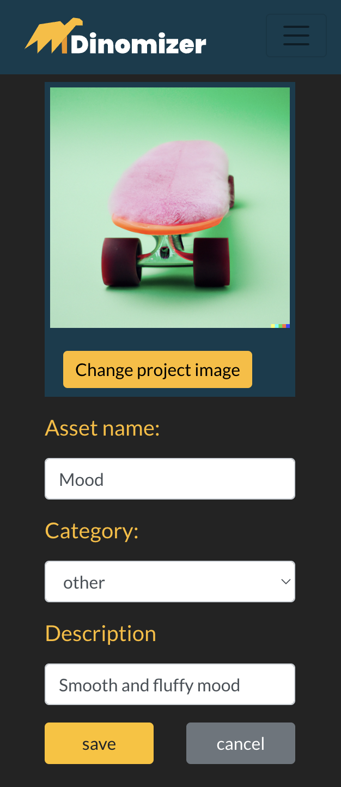

# Dinomizer

Dinomizer is a web application designed to assist Creative Agencies with teams dispersed globally or working remotely. This application streamlines asset retrieval for projects by centralizing all assets in one location. This ensures that all project stakeholders can access the latest version of required assets, thus minimizing time loss.

Dinomizer is built using Django Rest Framework for the backend and React JS for the frontend. This project was created as my fifth portfolio project for my Diploma in Web Application Development at Code Institute.

Here is the live version of the application: [Dinomizer](https://dinomizer-6ec16116a4cb.herokuapp.com/)

## Project Goals

- Full featured assets sharing service
- Create and partecipate to a project
- Upload assets like images, videos, audio and text
- Contribute to a project
- Get approvals by the project manager (project owner) on the assets uploaded

## Contents

- [Dinomizer](#dinomizer)
  * [Project goals](#project-goals)
  * [Contents](#contents)
  * [The Idea](#the-idea)
  * [User stories](#user-stories)
  * [Planning and Agile methodology](#planning-and-agile-methodology)
    + [Mockups](#mockups)
    + [Data models](#data-models)
    + [Agile methodology](#agile-methodology)
  * [Design](#design)
    + [Colours](#colours)
    + [Fonts](#fonts)
  * [Features](#features)
    + [Branded landing page](#branded-landing-page)
    + [Sign-up form](#sign-up-form)
    + [Sign-in form](#sign-in-form)
    + [Navigation Bar](#navigation-bar)
        + [Logged out options](#logged-out-options)
        + [Logged in options](#logged-in-options)
            + [New project](#new-project)
            + [Timeline](#timeline) (All the existing projects with Assets preview)
            + [Projects](#projects) (Projects a User joins)
            + [Contribute](#contribute) (Filtered Assets)
            + [Profile page](#profile-page)
    + [Projects list](#project-list)
    + [Project details](#project-details)
    + [Project controls](#project-controls)
    + [Project create form](#project-create-form)
    + [Project edit form](#project-edit-form)
    + [Assets carousel](#assets-carousel)
    + [Asset details](#asset-details)
    + [Asset dropdown menu](#asset-dropdown-menu)
    + [Asset create form](#asset-create-form)
    + [Asset edit form](#asset-edit-form)
    + [Profile detail page](#profile-detail-page)
    + [Search bar](#search-bar)
    + [Modal box](#modal-box)
    + [Error messages](#error-messages)
  * [CRUD functionality](#crud-functionality)
  * [Reuse of components](#reuse-of-components)
  * [Custom hooks](#custom-hooks)
  * [Context](#context)
  * [Testing](#testing)
  * [Deployment](#deployment)
  * [Future improvements](#future-improvements)
  * [Framework and libraries](#framework-and-libraries)
  * [Credits](#credits)

## The Idea
My professional background lies in the video production and communication field. I owned my communication agency and worked with many of them as a freelancer. Sharing files and assets is crucial in such environments but sometimes the people involved in the same project are not updated on the last version of that logo or last version of the copywriting for a specific website.

 

To perform my job as video producer/maker at the best I often use a platform called [CI](https://cimediacloud.com/) (no pun intend... Code Institute!!!) from sony and it's from there that I took the inspiration. Though I'm pretty far from achieving Sony's results, I think Dinomizer come out as a nice CI wannabe.

## User stories
The user stories were developed after defining the [project goals](#project-goals). Firstly I identified which could be the epics under which the user stories were grouped and after that I assigned them to the ipothetic backlog(Iteration) (this part is discussed in the [Planning and Agile methodology](#planning-and-agile-methodology)). The following chart can be found as a spreadsheet [here](https://docs.google.com/spreadsheets/d/1dO9Zj2uhU90JMJT0_W85nkQjaKAbOLGk1Hr0KajRhKQ/edit#gid=1780070774).

***

| Iteration   | Epic                        | User story                                                                                                                                                                                                             | MVP | Note                                                                                       | Delivered |
| ----------- | --------------------------- | ---------------------------------------------------------------------------------------------------------------------------------------------------------------------------------------------------------------------- | --- | ------------------------------------------------------------------------------------------ | --------- |
| Iteration 1 | User and Profile management | Account registration As a user I can sign upso that I can create projects and contribute to it                                                                                                                      | Yes |                                                                                            | Yes       |
| Iteration 1 | User and Profile management | Sign In As a User I can sign in so that I have access to all the feature of the application | Yes |                                                                                            | Yes       |
| Iteration 1 | User and Profile management | Refreshing access tokens As a logged in user I can stay logged in so that I don't have to sign in everytime                                                                                                         | Yes |                                                                                            | Yes       |
| Iteration 1 | Workflow and Navigation     | See the Navbar As a Signed in User I can navigate the site so that I can see the various pages of the site                                                                                                          | Yes |                                                                                            | Yes       |
| Iteration 1 | Workflow and Navigation     | Display Sign In or Sign up if logged out As a User I can see option for signing in or signing up so that I can register a new user or sign in with my credentials                                                   | Yes |                                                                                            | Yes       |
| Iteration 2 | Workflow and Navigation     | Sign Out As a logged in user I can sign out so that someone else can't have access to my profile                                                                                                                    | Yes |                                                                                            | Yes       |
| Iteration 2 | User and Profile management | Profile page As a logged-in user I can see other users' profiles so that I can see their details included on which project they are working on                                                                      | Yes | Partialy delivered because the projects on which the user is partecipating are not visible | Yes       |
| Iteration 2 | User and Profile management | Edit profile As a logged-in user I can edit my profile so that I can update my display name and my picture                                                                                                          | Yes |                                                                                            | Yes       |
| Iteration 2 | User and Profile management | Update password As a logged-in user I can update my password so that I can keep my profile secured                                                                                                                  | Yes |                                                                                            | Yes       |
| Iteration 2 | Workflow and Navigation     | Routing As a user I can navigate through pages quickly so that I can view content seamlessly without page refresh                                                                                                   | Yes |                                                                                            | Yes       |
| Iteration 2 | Workflow and Navigation     | Logged status As a a logged in user I can tell my log status so that I can sign out if I want to                                                                                                              | Yes |                                                                                            | Yes       |
| Iteration 3 | Projects management         | Create projects As a logged In User I can create a new project so that I can start working on it                                                                                                                    | Yes |                                                                                            | Yes       |
| Iteration 3 | Projects management         | Contribute to project As a Logged in user I can contribute to a project so that I can work on it                                                                                                                    | Yes |                                                                                            | Yes       |
| Iteration 3 | Projects management         | Project's detail As a logged-in user I can see the details of a project so that I can see all the info about it                                                                                                     | Yes |                                                                                            | Yes       |
| Iteration 3 | Projects management         | View projects As a logged-in user I can see a list of all projects so that I can decide to which one contribute                                                                                                     | Yes |                                                                                            | Yes       |
| Iteration 4 | Projects management         | Search for projects As a logged-in user I can search for projects so that I can find what I'm looking for                                                                                                           | Yes |                                                                                            | Yes       |
| Iteration 4 | Workflow and Navigation     | Infinite projects scroll As a logged-in user I can scroll down so that I can see all the created projects without reloading the page                                                                                | Yes |                                                                                            | Yes       |
| Iteration 4 | Projects management         | My projects list As a logged-in user I can see the list of the projects I'm working on so that I've my job under control                                                                                            | Yes |                                                                                            | Yes       |
| Iteration 4 | Projects management         | Edit projects As a Project Owner I can edit the project so that I can change the details of the project, like the title, dates and status                                                                           | Yes |                                                                                            | Yes       |
| Iteration 5 | Assets management           | Create assets As a logged-in user I can create assets so that I can add them to projects                                                                                                                            | Yes |                                                                                            | Yes       |
| Iteration 5 | Assets management           | Assets list in contribute As a Project Contributor I can see a filtered list of all my contributions so that I know what I'm working on                                                                             | Yes |                                                                                            | Yes       |
| Iteration 5 | Projects management         | Contributor list for project As a logged-in user I can click on a project so that I can see all the contributors and contributions related to that project                                                          | Yes |                                                                                            | Yes       |
| Iteration 6 | Assets management           | Assets list As a Project Contributor I can see the list of all assets related to that project so that i have a clear view of the whole project                                                                      | Yes |                                                                                            | Yes       |
| Iteration 6 | Workflow and Navigation     | Infinite contributions scroll As a logged-in user I can scroll down so that I can see all the contributions to that project without reloading the page                                                              | Yes |                                                                                            | Yes       |
| Iteration 6 | Assets management           | Asset check As a Project manager/Project owner I can approve a contribution with a check so that the contributor knows that it was approved                                                                         | Yes | This is a restricted functionality reserved to the project owner                           | Yes       |
| Iteration 6 | Assets management           | Delete assets As a asset owner I can delete an asset so that I'm sure is not needed anymore in the project                                                                                                          | Yes |                                                                                            | Yes       |
| Iteration 6 | Projects management         | Delete projects As a project owner I can delete my projects so that they are not displayed anymore                                                                                                                  | Yes |                                                                                            | Yes       |
| Iteration 6 | Assets management           | Update assets As a asset owner I can update or delete an asset so that the asset is always updated                                                                                                                  | Yes |                                                                                            | Yes       |
|             | Assets management           | Create comments As a project contributor I can comment on contributions so that I can express my opinion                                                                                                            | No  |                                                                                            | No        |
|             | Assets management           | Edit and Delete comments As a comment owner I can edit or delete comments so that I'm free to change my mind                                                                                                        | No  |                                                                                            | No        |
|             | User and Profile management | Less busy user As a project manager I can see the less busy user so that I can assign him a task                                                                                                                    | No  |                                                                                            | No        |
|             | Projects management         | Assign user to a project As a project manager I can assign user to a project so that they can work on it                                                                                                            | No  |                                                                                            | No        |

## Planning and Agile methodology
### Agile methodology
The methodology used to develope Dinomizer is Agile. I use the "issues" feature, present on GitHub, to track down all the steps needed to deliver the MVP.
As a first step I created a new project (board type) called Dinomizer ([Dinomizer GitHub project](https://github.com/users/fabi8bit/projects/6/views/1))and a new issue template that I used as bed for the user stories creation. I opened an issue for every user stories. I gave them a title and a description. I created custom labels and assigned them to the user stories.
The user stories created were assigned to the Dinomizer project and piled up in the todo column.
In the issues I created the first Milestone, that I used as Iteration and assigned it 3 to 4 user stories.

At the same time, in the project board, I moved the same user stories from the "todo" column to the "In Progress" column. 

I assigned the first iteration a timebox of 3 days and tried to complete the tasks by the deadline. If some user stories were left, I moved them to the next iteration and so on.

As soon as the user stories were satisfied, I marked them as closed and in the project they were automatically moved from the "In Progress" column to the "Done" column.

## Design

## Features

### Navigation Bar

### Logged out options

### Logged in options

#### New project
#### Timeline
#### Projects
#### Contribute
#### Profile page

### Branded landing page

***

### Sign-up form

### Sign-in form

### Project list

### Project details

***

### Project controls

***

***

### Project create form

***

### Project edit form

***

### Assets carousel

***

### Asset details

***

### Asset dropdown menu

### Asset create form

***

### Asset edit form

***

### Profile detail page

***

### Search bar

***

### Modal box

### Error messages

## CRUD functionality

## Reuse of components

## Custom hooks

## Context

## Testing

## Deployment

## Future improvements

## Framework and libraries

## Credits

## Future improvements
- create an Organization that contains projects
- set a local storage to store original files (large size)
- create authomatic lowres file to display inside the app
- evaluate team capacity
- diagram that displays how busy a user is so as a project manager I can decide to whom assign a task
- side navbar for a more appealing user experience

side navbar
https://www.youtube.com/watch?v=IathdVB65Lw&t=217s