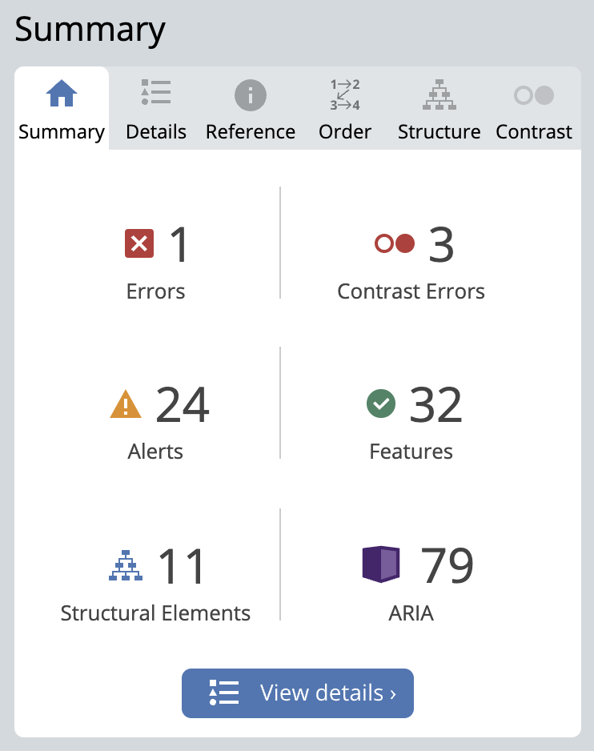

# Dinomizer

Dinomizer is a web application designed to assist Creative Agencies with teams dispersed globally or working remotely. This application streamlines asset retrieval for projects by centralizing all assets in one location. This ensures that all project stakeholders can access the latest version of required assets, thus minimizing time loss.

Dinomizer is built using Django Rest Framework for the backend and React JS for the frontend. Thanks to the use of ReactJS library it is possible to handle client-side routing, create CRUD functionality for users from an API, make async await network requests for form submission, and use of context.

This project was created as my fifth portfolio project for my Diploma in Web Application Development at Code Institute.

Here is the live version of the application: [Dinomizer](https://dinomizer-6ec16116a4cb.herokuapp.com/)

## Project Goals

- Full featured assets sharing service
- Create and partecipate to a project
- Upload assets like images, videos, audio and text
- Contribute to a project
- Get approvals by the project manager (project owner) on the assets uploaded

## Contents

- [Dinomizer](#dinomizer)
  * [Project goals](#project-goals)
  * [Contents](#contents)
  * [The Idea](#the-idea)
  * [User stories](#user-stories)
  * [Planning and Agile methodology](#planning-and-agile-methodology)
    + [Mockups](#mockups)
    + [Data models](#data-models)
    + [Agile methodology](#agile-methodology)
  * [Design](#design)
  * [Features](#features)
    + [Navigation Bar](#navigation-bar)
        + [Logged out option](#logged-out-option)
        + [Logged in option](#logged-in-option)
            + [New project](#new-project)
            + [Timeline](#timeline) (All the existing projects with Assets preview)
            + [Projects](#projects) (Projects a User joins)
            + [Contribute](#contribute) (Filtered Assets)
            + [Profile page](#profile-page)
    + [Branded landing page](#branded-landing-page)
    + [Sign-up form](#sign-up-form)
    + [Sign-in form](#sign-in-form)
    + [Timeline (project list)](#timeline-project-list)
    + [Project details](#project-details)
    + [Project controls](#project-controls)
    + [Project create form](#project-create-form)
    + [Project edit form](#project-edit-form)
    + [Assets carousel](#assets-carousel)
    + [Asset details](#asset-details)
    + [Asset dropdown menu](#asset-dropdown-menu)
    + [Asset create form](#asset-create-form)
    + [Asset edit form](#asset-edit-form)
    + [Profile detail page](#profile-detail-page)
    + [Profile edit form](#profile-edit-form)
    + [Search bar](#search-bar)
    + [Modal box](#modal-box)
    + [Error messages](#error-messages)
  * [CRUD functionality](#crud-functionality)
  * [Reuse of components](#reuse-of-components)
  * [Custom hooks](#custom-hooks)
  * [Context](#context)
  * [Testing](#testing)
  * [Validator Testing](#validator-testing)
  * [Bugs and development obstacles](#bugs-and-development-obstacles)
  * [The greatest Bug, I've ever come accross](#the-greatest-bug-ive-ever-come-accross)
  * [Deployment](#deployment)
  * [Future improvements](#future-improvements)
  * [Framework and libraries](#framework-and-libraries)
  * [Credits](#credits)
  * [Thanks](#thanks)

## The Idea
My professional background is rooted in the video production and communication field. I previously owned my own communication agency and also worked as a freelancer, collaborating with numerous clients. In such contexts, effective file and asset sharing is paramount. However, it's not uncommon for individuals working on the same project to be unaware of the latest version of a logo or the most recent copywriting updates for a particular website.

 

To excel in my role as a video producer and creator, I frequently utilize a platform called [CI](https://cimediacloud.com/) (no pun intended ... Code Institute!), developed by Sony. It was from this platform that I drew my inspiration. While I recognize that I have a long way to go before achieving the same results as Sony, I believe that Dinomizer has emerged as a worthy CI aspirant.

## User stories
The user stories were developed following the definition of the [project goals](#project-goals). Initially, I identified the potential epics under which the user stories could be categorized. Afterward, I assigned them to the hypothetical backlog (Iteration), as discussed in the [Planning and Agile methodology](#planning-and-agile-methodology).

The User Stories are listed in [this document](USERSTORIES.md). Instead you can access the corresponding chart in the form of a spreadsheet [here](https://docs.google.com/spreadsheets/d/1dO9Zj2uhU90JMJT0_W85nkQjaKAbOLGk1Hr0KajRhKQ/edit#gid=1780070774).
***

## Planning and Agile methodology
### Mockups

Based on the goals and user stories, I created sketches that I used as a foundation for designing the wireframes for the entire web application.

After creating the initial sketches, I designed the complete wireframe application using [Adobe XD](https://www.adobe.com/products/xd/learn/get-started-xd-design.html). The fully interactive public wireframe application (for desktop only) can be accessed [here](https://xd.adobe.com/view/bc9e5f77-a435-416f-9f37-6dbc2d3b28dd-e9cd/?fullscreen&hints=off).

Log In / Sign up / Profile page

Project related pages

Asset related pages

The full-size wireframes can be viewed in [this document](WIREFRAMES-FULL.md).

The wireframes served as a guiding reference throughout the frontend development process. While numerous adjustments were necessary when confronted with real-world scenarios, they remained essential in maintaining focus on the application's scope.
***

The Navbar:

In the wireframe, it is depicted as a sidebar, but in the final product, it takes the form of a classic fixed navbar at the top. This design choice is primarily driven by technical considerations. I attempted to develop the sidebar version, but I encountered challenges and felt unsatisfied with the result. Consequently, I chose to prioritize the Minimum Viable Product (MVP) and omitted it from the initial release. However, it remains a part of my future development plans because it aligns well with the project's concept, and I'm passionate about its implementation.
***

Timeline / Projects

It represents the project list containing all the projects created. Initially, I envisioned it divided into three different columns: one for projects 'in progress,' one for planned projects, and one for overdue projects. However, in practice, the page appeared cluttered and posed issues for mobile screens. In the final design, I simplified it to have one column for the project and a separate column for the assets connected to each project. More details about this can be found in the [feature section](#project-list).
***

Contribute / Assets

This page lists all the assets created by users, providing a comprehensive overview of the work completed by the users.
***

### Data models
Data models were also sketched on paper alongside the wireframes.

The sketches were subsequently translated into designs using [drawSQL](https://drawsql.app/teams/fabi8steam/diagrams/dinomizer). You can view the original drawing at [this link](https://drawsql.app/teams/fabi8steam/diagrams/dinomizer).

The task model was not included in the MVP and, therefore, was not developed.
On the other hand, the comment model was developed in the backend but was not utilized in the frontend because it was not required for the MVP. It has been left for implementation in future versions of Dinomizer.
You can find detailed information about the models and backend development in a separate repository, which is accessible [here](https://github.com/fabi8bit/dinomizer_drf_pp5). For direct access to the backend README.md file, you can follow [this link](https://github.com/fabi8bit/dinomizer_drf_pp5/blob/main/README.md).

### Agile methodology

The development methodology employed for Dinomizer is Agile. I used the 'Issues' feature on GitHub to meticulously track all the steps necessary to deliver the Minimum Viable Product (MVP).

To begin, I initiated a new project board, of type 'board,' aptly named 'Dinomizer' (accessible at [Dinomizer GitHub project](https://github.com/users/fabi8bit/projects/6/views/1)). Furthermore, I created a customized issue template that served as the foundation for crafting user stories. Each user story was given its title and description. To facilitate organization, I established custom labels and appropriately assigned them to the user stories.
The user stories were subsequently assigned to the 'Dinomizer' project board and placed in the 'To-Do' column. Within the 'Issues' section, I established the Milestone, serving as an Iteration, and systematically assigned 3 to 4 user stories to it.

Simultaneously, within the project board, I moved the same user stories from the 'To-Do' column to the 'In Progress' column.

I allocated a timebox of 3 days for the first iteration and aimed to complete the tasks within that timeframe. If there were any remaining user stories, I transferred them to the next iteration, continuing this process as needed.

As soon as the user stories were successfully completed, I marked them as 'closed.' In the project board, this action automatically shifted them from the 'In Progress' column to the 'Done' column.

## Design

The name 'Dinomizer' was proposed by my colleague Alessandro Corinti at [Pomodoro Communication Agency](https://www.pomodoroproduzioni.it/). It's a sort of acronym, standing for 'DIgital Nomads organIZER.' Naturally, the name also inspired the idea of a dinosaur, which served as the basis for the logo design. I crafted the logo using [Adobe Illustrator](https://www.adobe.com/products/illustrator.html) and selected the color palette using [Adobe Color](https://color.adobe.com/).
I opted for high-contrast colors to enhance the overall readability of the entire website.

For the background of the project and asset cards, I selected a dark gray color (#343a40) to provide the appropriate contrast without being overly harsh on the eyes. The font chosen for the logo is 'Poppins,' while I opted for 'Lato' for the text.
***

## Features

### Navigation Bar
The navigation bar was initially conceived as a sidebar but was later changed to a traditional top navbar after conducting some design tests. Utilizing conditional rendering based on the user's status, it offers two options: 'Logged Out' and 'Logged In.

### Logged out option

When the user is logged out, the Navbar only displays two available buttons: 'Sign In' and 'Sign Up'.

### Logged in option

Upon a user's login, the Navbar presents five available options: 'New Project,' 'Timeline,' 'Projects,' 'Contribute,' and 'Profile Page.

#### New project
This button is linked to the [project create form](#project-create-form) and is used for creating new projects.
#### Timeline
When clicked, it displays a list of all the projects created on the page, as explained in the chapter [Timeline](#timeline-project-list).
#### Projects
This button allows users to navigate to the projects page, which is essentially a filtered version of the [projects page](#project-list--timeline).
#### Contribute
Clicking here will redirect the user to the list of assets created by the user, which I've named the 'Contribute' page.
#### Profile page
The 'Profile Page' link features dynamic text that changes to the name of the logged-in user. Clicking on it redirects the user to the [profile page](#profile-page).
***

### Branded landing page
Desktop | Mobile
:-------------------------:|:-------------------------:
 | 

This is the home page of Dinomizer when a user is not logged in. It includes a jumbotron element that provides a brief explanation of what Dinomizer is. At the bottom, you'll find two buttons: 'Sign In' and 'Sign Up,' with their functions being self-explanatory.
***

### Sign-up form
Desktop | Mobile
:-------------------------:|:-------------------------:
 | 

The form includes only three input fields: Username, Password, and Confirm Password. Password validation is performed by Django's Password management, requiring a minimum of 8 characters. Upon signing up, a user profile is created alongside their account. When proceeding to the [Profile page](#profile-page), users have the opportunity to provide additional information, such as a profile image, real name, and bio.
After successfully signing up, users are automatically redirected to the Sign-In form.
***

### Sign-in form
Desktop | Mobile
:-------------------------:|:-------------------------:
 | 

On this page, the user is required to enter the username and password chosen during the [sign up](#sign-up-form) process. If the provided information is correct, the user will be redirected to the [timeline page](#timeline-project-list).
***

### Timeline (project list)
Desktop | Mobile
:-------------------------:|:-------------------------:
 | 

This page serves as the main hub of the application, listing all the projects created by every user along with their associated assets. The page is structured with two adjacent columns:

Left Column: In this column, project cards are displayed, featuring essential information such as the project title, owner, due date, and current status. At the bottom, there's a control bar component. The controls within this component are dynamically rendered based on the user's status, and you can find detailed information about this in the [Project Controls](#project-controls) section. Clicking on the header section of a project card allows users to access the [project's detail view](#project-details).

Right Column: In this column, cards representing the assets linked to the selected project are displayed. Since a project can have multiple assets, I chose to utilize the carousel element from React Bootstrap to present these assets. More details about this component can be found in the [Assets Carousel](#assets-carousel) section.
***

### Project details
Desktop | Mobile
:-------------------------:|:-------------------------:
 | 

The structure of this page mirrors that of the [timeline (project list)](#timeline-project-list) discussed in the previuos chapter. When accessing the project details, more comprehensive information about the project becomes visible, including content and contributors, in addition to the details already available in the list view. As on the list view, it's also possible to access the control bar at the bottom.
In the right column, the asset carousel provides the same functionality as in the [timeline (project list)](#timeline-project-list).
***

### Project controls
Status | Component
:-------------------------:|:-------------------------:
Joined, Owner | 
Not joined | 
Joined, not Owner | 
Not joined, Owner | 

The project controls serve as the visual representation of certain CRUD (Create, Read, Update, Delete) functionalities related to the Project model. This is a dynamic component that renders different buttons based on the user's status. It's important to note that not every button is always present, as depicted in the image.

- The first button is the 'Join/Unjoin' button: When clicked, it registers a new record in the participant model and displays a different icon, the 'Unjoin' icon.
- The second button is only revealed after joining a project. Its function is to create a new asset for the project. When the button is clicked, the user is presented with the [asset creation form](#asset-create-form). Users have the freedom to create as many assets as they require.
- The third and fourth buttons are responsible for the CRUD (Create, Read, Update, Delete) functionalities related to editing and deleting assets. When a user clicks on the pen icon, they are presented with the [Asset edit form](#asset-edit-form), where they have the freedom to make the necessary changes. Clicking on the fourth button will result in the deletion of the project. To ensure the user doesn't perform this operation accidentally, a [modal page](#modal-box) will be displayed, requesting confirmation, as this action is not reversible.
***

### Project create form
Desktop | Mobile
:-------------------------:|:-------------------------:
 | 

This form is accessible after clicking the 'New Project' button in the Navbar. It's where the user can input all the details related to the project, including: Project name, content, start date, expected end date, status, and cover image. All the input fields are self-explanatory, including the 'Status' dropdown, where the user can choose one of the three options: 'Planned,' 'In Progress,' or 'Completed.' In future versions of Dinomizer, these options will be used to filter and sort search results. Upon submitting the form, the user will be redirected to the [Project details](#project-details) page.
***

### Project edit form
Desktop | Mobile
:-------------------------:|:-------------------------:
 | 

This form is accessible after clicking the 'Pencil' edit button in the project's control bar. Here, the user can update the data that was initially entered during the project creation process. Upon submitting the form, the user will be redirected to the [Project details](#project-details) page.
***

### Assets carousel
Checked asset

Unchecked asset

The asset carousel serves as a concise visual representation of the assets. Within this component, all the assets associated with a specific project are collected. Each asset card includes a preview picture, which was uploaded during the creation process of the asset, as well as minimal information such as the title and the date of the last update. On both the left and right sides of each card, there are arrow buttons for scrolling through the carousel. A special 'check' flag appears on top of the title if the project manager (project owner) has marked this asset as 'Checked'. You can find more details on this in the description of the ['Check' option in the Dropdown menu section](#asset-dropdown-menu). Clicking on the picture or the icon next to the title allows access to the asset's details view.
***

### Asset details
Desktop | Mobile
:-------------------------:|:-------------------------:
 | 

On this page, the user can view all the details of the asset. In addition to the inputs provided by the user during the creation process, there are also additional informations such as the 'related project,' which is a field provided by the frontend logic, and the asset's owner. Furthermore, a [dropdown menu](#asset-dropdown-menu) that overlays the cover image is present.
***

### Asset dropdown menu

The asset dropdown menu is a dynamic component that renders its options based on various conditions. Not all options are presented to the user; instead, they are conditionally rendered based on the user's state and the content of the asset. If the user is the owner of the asset, they will see the 'Edit' and 'Delete' options. If the user is also the project owner of the project to which the asset is related, the 'Check' option will also be visible. The 'Download' option is presented only if a real asset is associated with the item (more details on this are available in the [asset create form](#asset-create-form)).

### Asset create form
Desktop | Mobile
:-------------------------:|:-------------------------:
 | 

This form is accessible after clicking the 'Create Asset' button in the project's control bar. Here, the user can input all the details related to the asset, including: Asset name, Category, Description, Upload Asset, and Cover Image. The 'Category' input is a dropdown menu with the following options for the user to choose from: Graphic, Video, Audio, Copywriting, and Other. After submission, the user will be redirected to the Asset detail page.
It's worth noting that the 'Upload Asset' field is not required, and this deliberate choice allows the asset element to be very flexible and used, for example, as a checklist or memorandum.
***

### Asset edit form
Desktop | Mobile
:-------------------------:|:-------------------------:
 | 

This form is accessible after clicking the 'Edit' option in the [dropdown menu](#asset-dropdown-menu). This option is visible only if the user is the owner of the asset. Within this form, users can update the data that was initially entered during the [asset creation process](#asset-create-form). Upon submitting the form, the user will be redirected to the [Asset detail page](#asset-details).
***

### Profile detail page
Desktop | Mobile
:-------------------------:|:-------------------------:
 | 

The profile page serves as the location where all available details for a profile are visible. These details include the profile image, real name, bio, registration date, last profile update, and, of course, the username chosen during the user registration. The username is displayed in the page title. If the user is the owner of the profile, the page will also render the 'Edit' and 'Sign Out' buttons.
***

### Profile edit form
Desktop | Mobile
:-------------------------:|:-------------------------:
 | 

A user has the ability to edit the details of their profile, which includes the option to change their password along the other fields like Image, Real name, and Bio.
***

### Search bar

Through the use of the search bar, a user can search for projects. The search operation is performed by examining the title, content, and owner.

The search bar for Assets is available on the Contribute page, where all the assets created by a user are listed. By using the search bar, a user can search for assets, and the search operation involves examining the asset name, category, and owner.

### Modal box
Desktop | Mobile
:-------------------------:|:-------------------------:
 | 

When a user attempts to delete a project or an asset, the item is not immediately removed. Deletion is considered irreversible, so a modal page pops up to confirm the operation.
***

### Error messages

All input fields in the forms are processed through a control system. In the event of errors occurring during submission, warning messages are displayed under the fields affected by the error.

## CRUD functionality
Dinomizer delivers robust functionality encompassing the creation, retrieval, updating, and deletion of various elements. This capability is made accessible through a user interface developed using React JS in combination with the Django Rest Framework API. The web application empowers users to create and manage profiles, projects, assets, and checks, presenting these elements in both list and detailed views. Users possessing the necessary permissions, including ownership rights, can utilize dedicated forms to make updates and deletions to these elements.

## Reuse of components
Some of the components of Dinomizer where coded with the intention of writing less code and those includes:

- Avatar Component:

  The Avatar component is utilized to display a user's profile picture across various pages within the site.
  It accepts two props: src for the image source and height for the image's height.

- Back Button Component:

  The Back Button component utilizes the useHistory hook to enable users to navigate back to the previous page they were on.

- Placeholder Component:

  The Placeholder component serves multiple purposes, such as displaying loading spinners and cover images for Project and Asset creation forms.
  It accepts three props: src for the image source, spinner as a switch for conditionally rendering the loading spinner, and msg to display a message, as seen in the NotFound component.

- DeleteModal Component (Again):

  The DeleteModal component handles the deletion operation after receiving user confirmation.
  It's used for deleting projects and assets and takes several props: `type` specifies the element type in the confirmation message, `name` represents the name of the element, `change` toggles the showModal state, and `deleteitem` sends the appropriate Axios request to delete the element.

- Project Component:

  The Project component is employed whenever a project needs to be displayed, whether on project lists or in project details.
  It features conditionally rendered elements based on its usage (project list or project detail) and leverages various props to achieve this. For instance, the projectPage prop acts as a flag to indicate that the component should render specific parts, and it does so based on the value of this prop.

- Asset Component:

  The Asset component follows a similar logic as the Project component, with the ability to conditionally render elements based on its usage. It takes in props to determine how it should behave and what to display, whether in the list view or asset detail view or in the AssetCarousel.

## Custom hooks
The two custom hooks present on this project are useRedirect and useClickOutsideToggle and are borrowed from the walkthrough project of Code Institute called Moments.
- useRedirect Custom Hook:

  The useRedirect custom hook serves a crucial role in the project by checking whether a user is still logged in. If not, it redirects the user to the logged-out page.
  It is also employed to redirect logged-in users who attempt to access sections of the site that are unnecessary for someone already logged in, such as the sign-in page. For instance, if a user accidentally enters the direct URL for the sign-in page, they are redirected to the home page, which is the timeline page.

- useClickOutsideToggle Custom Hook:

  The useClickOutsideToggle custom hook is utilized in the collapsed navbar(mobile) and plays a significant role in providing a smoother user experience. It automatically collapses the navbar menu when a user clicks on an option or anywhere outside of the navbar. This eliminates the need for the user to click the burger menu again, contributing to a more user-friendly experience.

## Context
Context is a powerful feature provided by React JS. In this project, the CurrentUserContext is borrowed from the Code Institute's walkthrough project called Moments. It plays a crucial role in various parts of the application, allowing checks on user permissions to perform various tasks. For example, it ensures that users have the necessary permissions to change their profile password.

## Testing
Testing was conducted throughout the development of the web application and followed the chronological order of the user stories outlined in the Iterations, as documented in the [Agile methodology section](#agile-methodology). The details of manual tests conducted on Dinomizer are provided in [this document](TESTS.md). Alternatively, the test results can be accessed in spreadsheet format at this [link](https://docs.google.com/spreadsheets/d/1dO9Zj2uhU90JMJT0_W85nkQjaKAbOLGk1Hr0KajRhKQ/edit#gid=1323818088).

Only one automated test was conducted, and it was on the NavBar:
- renders link to the user profile for a logged in user - passed

## Validator Testing

### W3C CSS validator

| Page checked                                                                                                                                   | Error found                                                                              | Fix | Commit                                                                                                     | Final result    |
| ---------------------------------------------------------------------------------------------------------------------------------------------- | ---------------------------------------------------------------------------------------- | --- | ---------------------------------------------------------------------------------------------------------- | --------------- |
| [https://dinomizer-6ec16116a4cb.herokuapp.com/](https://dinomizer-6ec16116a4cb.herokuapp.com/projects)                                         | .Button_Button__27i9m only 0 can be a unit. You must put a unit after your number : 5 | Yes | [fb59582](https://github.com/fabi8bit/dinomizer_react_pp5/commit/fb595824092d968b62e9e3f8138d4d94e714c190) | No Errors Found |
| [https://dinomizer-6ec16116a4cb.herokuapp.com/projects](https://dinomizer-6ec16116a4cb.herokuapp.com/projects)                                 | .Button_Button__27i9m only 0 can be a unit. You must put a unit after your number : 5 | Yes | [fb59582](https://github.com/fabi8bit/dinomizer_react_pp5/commit/fb595824092d968b62e9e3f8138d4d94e714c190) | No Errors Found |
| [https://dinomizer-6ec16116a4cb.herokuapp.com/assets](https://dinomizer-6ec16116a4cb.herokuapp.com/assets)                                     | .Button_Button__27i9m only 0 can be a unit. You must put a unit after your number : 5 | Yes | [fb59582](https://github.com/fabi8bit/dinomizer_react_pp5/commit/fb595824092d968b62e9e3f8138d4d94e714c190) | No Errors Found |
| [https://dinomizer-6ec16116a4cb.herokuapp.com/profiles/6](https://dinomizer-6ec16116a4cb.herokuapp.com/profiles/6)                             | .Button_Button__27i9m only 0 can be a unit. You must put a unit after your number : 5 | Yes | [fb59582](https://github.com/fabi8bit/dinomizer_react_pp5/commit/fb595824092d968b62e9e3f8138d4d94e714c190) | No Errors Found |
| [https://dinomizer-6ec16116a4cb.herokuapp.com/projects/21](https://dinomizer-6ec16116a4cb.herokuapp.com/projects/21)                           | .Button_Button__27i9m only 0 can be a unit. You must put a unit after your number : 5 | Yes | [fb59582](https://github.com/fabi8bit/dinomizer_react_pp5/commit/fb595824092d968b62e9e3f8138d4d94e714c190) | No Errors Found |
| [https://dinomizer-6ec16116a4cb.herokuapp.com/assets/37](https://dinomizer-6ec16116a4cb.herokuapp.com/assets/37)                               | .Button_Button__27i9m only 0 can be a unit. You must put a unit after your number : 5 | Yes | [fb59582](https://github.com/fabi8bit/dinomizer_react_pp5/commit/fb595824092d968b62e9e3f8138d4d94e714c190) | No Errors Found |
| [https://dinomizer-6ec16116a4cb.herokuapp.com/projects/create](https://dinomizer-6ec16116a4cb.herokuapp.com/projects/create)                   | .Button_Button__27i9m only 0 can be a unit. You must put a unit after your number : 5 | Yes | [fb59582](https://github.com/fabi8bit/dinomizer_react_pp5/commit/fb595824092d968b62e9e3f8138d4d94e714c190) | No Errors Found |
| [https://dinomizer-6ec16116a4cb.herokuapp.com/assets/create](https://dinomizer-6ec16116a4cb.herokuapp.com/assets/create)                       | .Button_Button__27i9m only 0 can be a unit. You must put a unit after your number : 5 | Yes | [fb59582](https://github.com/fabi8bit/dinomizer_react_pp5/commit/fb595824092d968b62e9e3f8138d4d94e714c190) | No Errors Found |
| [https://dinomizer-6ec16116a4cb.herokuapp.com/profiles/6/edit](https://dinomizer-6ec16116a4cb.herokuapp.com/profiles/6/edit)                   | .Button_Button__27i9m only 0 can be a unit. You must put a unit after your number : 5 | Yes | [fb59582](https://github.com/fabi8bit/dinomizer_react_pp5/commit/fb595824092d968b62e9e3f8138d4d94e714c190) | No Errors Found |
| [https://dinomizer-6ec16116a4cb.herokuapp.com/profiles/6/edit/password](https://dinomizer-6ec16116a4cb.herokuapp.com/profiles/6/edit/password) | .Button_Button__27i9m only 0 can be a unit. You must put a unit after your number : 5 | Yes | [fb59582](https://github.com/fabi8bit/dinomizer_react_pp5/commit/fb595824092d968b62e9e3f8138d4d94e714c190) | No Errors Found |

### WAVE web accessability testing

The website underwent WAVE web accessibility testing, and the results are documented in the following chart. Some of the issues identified were not addressed within the given time constraints. 

Page | Result | Errors
:------------------:|:-------------------------:|:-------------------------:
Sign In | 
Sign Up | 
Timeline |  | Missing form label detected on search bar
Projects |  | Missing form label detected on search bar
Contribute |  | Missing form label detected on search bar
Asset Detail | 
Logout page | 

### Lighthouse

The chart below summarizes the tests conducted using Google Chrome's Lighthouse tool. It's worth noting that some of the addressed issues, such as labels not being associated with forms and non-unique id attributes on active, focusable elements, still remain unresolved.

Page | Result Desktop | Result Mobile
:------------------:|:-------------------------:|:-------------------------:
Timeline |  | 
Projects |  | 
Project Edit Form |  |  N/A
Project detail |  | 
Profile |  | 
Create Project Form |  | 
Contribute |  | 
Asset detail |  | 

### Bugs and development obstacles

The application appears to be free of significant or obvious bugs, and everything functions as expected. However, during the development process, there were instances where I encountered unusual behavior that I was able to address and resolve for the final version of Dinomizer.
***

After creating the Asset form, I realized that I had made a mistake in defining the fields on the backend side. One of the features of the application is the ability to upload various types of media files, such as images, videos, and .txt files. However, at that point, my code could only upload images. Thanks to the support I received from Code Institute, I was able to resolve this issue. Sean provided valuable assistance for over an hour, helping me identify and fix the problem. He also discovered issues with my useState implementation in the frontend. Ultimately, we found the solution: the 'type' field in the Asset model needed to be changed to a Cloudinary field. This resolved the issue, and users can now upload images, videos, and .txt files as intended.
***

During the initial planning of the application, I had decided to skip implementing the search feature for projects. However, during the coding of the project page, I realized the need to include a search function for projects to enhance the overall user experience. As a result, I had to go back and implement this feature in the backend project. You can find the specific commit related to this update here: [Commit d5f3dae](https://github.com/fabi8bit/dinomizer_drf_pp5/commit/d5f3dae0e09241c17670ea45e4f573d8e00b6237).
***

During the development of the Asset form, I encountered the need to include additional fields such as profile_id, profile_image, and project_owner for assets. Similarly, I also found the need to include participants_id and participant_image for the participants' endpoints. To address this, I revisited the backend project and included these fields in the API. This approach was more efficient and convenient than making multiple requests to the server from the frontend to retrieve this information.
***

Throughout the development process, whenever I needed to make changes to the Django Rest Framework (DRF) project, I ensured that the ENV variable in the env.py file was activated. This allowed me to activate the Django view for checking the changes I made. Once I verified that the code was functioning as expected, I commented out the ENV variable, saved the changes, added them to Git, committed, pushed to GitHub, and redeployed to Heroku. This workflow helped me maintain a smooth development process.
***

The process of creating assets is managed by the AssetCreateForm.js component. Each asset must be associated with a project. On the backend, the project_id field is set to null: False, meaning it cannot be empty. However, since an asset can only be linked to a single project, I passed the project's ID to the AssetCreateForm.js component via the location.state.
To achieve this, I used the useHistory hook and included the project ID as a property in the state. In the Project.js component, the handleOpenCreateAsset function was responsible for this. By using the useHistory hook, I could add the project ID to the state and pass it to the AssetCreateForm.js component. I found [this post](https://dev.to/esedev/how-to-pass-and-access-data-from-one-route-to-another-with-uselocation-usenavigate-usehistory-hooks-1g5m#:~:text=Fortunately%2C%20React%20Router%20provides%20several,from%20the%20current%20location%20object) helpful in implementing this functionality.
***

If a non-logged-in user attempts to access the 'createassetsform' directly from the URL bar, an error is thrown. This occurs because no 'project_id' is passed to the form. To fix this issue, I implemented a function that handles this scenario by redirecting back (using 'history.goBack()') in cases where 'location.state.id' is not defined.
***

Submitting the asset edit form, threw a 503 Error from the server. After conducting research and seeking assistance from Code Institute (thank you Martin), I received valuable advice to run the server locally. Several changes were made to address this issue:
- In the frontend, under api/axiosDefaults.js, I adjusted the axios.defaults.baseURL settings, pointing to GitPod running the DRF.
- On the backend, I made sure that the DEV variable was commented out in the env.py file.

By following these steps, the real issue was revealed, and an error message was printed out in the backend console. The problem was traced to a missing trailing slash at the end of the PUT method in the 'handlesubmit' function. This bug was addressed and documented in [commit fca0586](https://github.com/fabi8bit/dinomizer_react_pp5/commit/fca058666ca5c5b83197185a44fc08105a889bb3).
***

When rendering the DOM, on the consolle I had the following warning: validateDomNesting(...), that was resolved thanks to [this post](https://stackoverflow.com/questions/55625431/warning-validatedomnesting-a-cannot-appear-as-a-descendant-of-a)
***

Trying to access someone else's profile password edit form directly from the URL doesn't result in being redirected to the timeline page. The user is not permitted to access someone else's password form, but even after adding the useRedirect hook, the issue persists.
***

When a user who hasn't joined any projects clicks on the "Project" button, should be presented with a blank page. However, in this particular scenario, there's an issue with the loading spinner that doesn't disappear as expected. This results in the user interface being only partially satisfying in terms of user experience.
***

In the AssetEditForm, not updating the image field resulted in a Bad Request from the server. After debugging both the Backend and Frontend, the issue was successfully resolved.
***

Deletion os a project is executed successfully. However, after the deletion process, a "history.goBack()" function is triggered, and sometimes the user is redirected to a non-existent page. Despite making multiple attempts to resolve this issue, it remains unresolved due to time constraints.

## The greatest Bug, I've ever come accross

I used eslint to check JavaScript files. I had some issues when installing the latest version of eslint. So I decided not to save changes and not push to GitHub. I opened a new gitpod workspace based on the last GitHub commitment. I then manually installed the 7.11.0 version of eslint on gitpod with the following command: `npm install eslint@7.11.0 --save-dev`. This information was taken from [this post](https://www.npmjs.com/package/eslint/v/7.11.0).

I then executed the command `touch .eslintrc.js` to create the eslintrc.js configuration file. In this file, I pasted the configuration copied from the [Andy Guthridge repository](https://github.com/andy-guttridge/tribehub_react/blob/main/.eslintrc.js). At this point, eslint was still causing issues and not allowing the application to run. Only after finding the discussion at [this link](https://discuss.codecademy.com/t/parsing-error-importdeclaration-should-appear-when-the-mode-is-es6-and-in-the-module-context/667899), and executing the command `npm audit fix` I was able to run the application. Eslint then detected various code errors:

 The error "react must be in scope when using jsx" was fixed simply by importing react into the files where it was missing, using the following code: `import React from "react";` the solution to this problem was taken from the post at [this link](https://kinsta.com/knowledgebase/react-must-be-in-scope-when-using-jsx/).
After fixing all errors detected by eslint, the application was successfully filled out. The changes were then added, committed, and pushed to github. But during the heroku deployment process, heroku detected an error:

       
      
-----> Installing dependencies 
      Installing node modules 
      npm ERR! code EUSAGE 
      npm ERR! 
      npm ERR! `npm ci` can only install packages when your package.json and package-lock.json or npm-shrinkwrap.json are in sync. Please update your lock file with `npm install` before continuing. 
      npm ERR! 
      npm ERR! Invalid: lock file's typescript@5.2.2 does not satisfy typescript@4.9.5 
      -----> Build failed

I researched the type of error in the Slack Code Institute community, and I found the solution by typing the command `npm install fix --force`. This solved the issue, and the application was successfully deployed on Heroku.

## Deployment

Take the following steps to deploy to Heroku:

- Fork or clone this repository on GitHub.

- If you've created your own version of the [Dinomizer API](https://github.com/fabi8bit/dinomizer_drf_pp5/), you'll need to set the base URL. Follow these steps:

  - Navigate to src/api/axiosDefaults.js.

  - Look for the following line of code:

  - `axios.defaults.baseURL = "********************";`

  - Replace "********************" with the base URL of your own Dinomizer API.

  - Pull the updates to your local development environment and, if needed, push them back to GitHub. 

- If you intend to use the original [Dinomizer API](https://github.com/fabi8bit/dinomizer_drf_pp5/), there's no need to modify this value, as it's already set for you.

- Log in to your Heroku account.

- Select 'Create new app' from the 'New' menu located at the top right.

- Provide a name for the app and select the appropriate region.

- Click 'Create app'.

- Head to the 'Deploy' tab at the top of the page.

- Choose 'GitHub' as the deployment method to confirm that you want to deploy using GitHub. You may need to enter your GitHub password.

- In the 'Connect to GitHub' section, use the search box to find your repository.

- Select 'Connect' once you've located it.

- In the 'Manual Deploy' section, choose the 'main' branch to deploy and select 'Deploy Branch'.

Once the deployment is complete, you'll see the "Open App" button. Clicking on it will take you to the live published site.

## Future improvements

- create an Organization that contains projects
- set a local storage to store original files (large size)
- create authomatic lowres file to display inside the app
- evaluate team capacity
- diagram that displays how busy a user is so as a project manager I can decide to whom assign a task
- side navbar for a more appealing user experience

## Framework and libraries

- React.js
- [react-router-dom](https://www.npmjs.com/package/react-router-dom)
- [Axios](https://www.npmjs.com/package/axios)
- [jwt-decode](https://www.npmjs.com/package/jwt-decode)
- [MUI Material Icons](https://mui.com/material-ui/material-icons/)
- [React Bootstrap](https://react-bootstrap-v4.netlify.app/components/)

## Credits

During the development of Dinomizer, my primary point of reference was the walkthrough project "Moments" by Code Institute, which proved to be an invaluable resource covering most of the requirements I encountered. However, I also relied on other posts and tutorials, which I have listed below:

[useHistory hook](https://dev.to/esedev/how-to-pass-and-access-data-from-one-route-to-another-with-uselocation-usenavigate-usehistory-hooks-1g5m#:~:text=Fortunately%2C%20React%20Router%20provides%20several,from%20the%20current%20location%20object)

[side navbar](https://www.youtube.com/watch?v=IathdVB65Lw&t=217s)

[React Router](https://www.educative.io/answers/what-are-the-exact-path-and-path-props-in-react-router)

[General infos on CSS - W3School](https://www.w3schools.com/)

[CSS alignment](https://www.w3schools.com/bootstrap4/tryit.asp?filename=trybs_flex-justify-center-responsive#:~:text=Justify%20content%20center-,Use%20the%20.,window%20to%20see%20the%20effect.)

Installing previous version of eslint - [this post](https://www.npmjs.com/package/eslint/v/7.11.0).

## Thanks
I want to express my sincere gratitude to my mentor Jubril for his invaluable support throughout the year. I also extend my heartfelt thanks to Andy Guttridge, who has been a great source of inspiration. Thank you both so much!